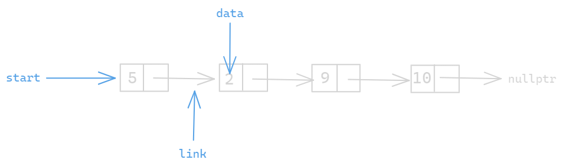

# Data Structures in C/C++

## Introduction

Hello, this repo contains all the major implementations of most widely used data structures like

- Singly Linked List
- Doubly Linked List
- Stacks
- Queues (Implemented as an Linked List.)
- Binary Tree
    - Binary Search Tree (BST)


> **NOTE:** For C language, function based approach is used. And Object Oriented approach is used for C++. But at the end of the day, it doesn't really matter as of which approach or programming language you pick as long as you understand the core concept behind it.

 >**NOTE:** All the code samples given below are just for the sake of understanding and are not complete in itself. It only represents the basic skeleton of the program. Refer the repository for more implementation details. 

## Singly Linked List

A linked list or singly linked list (to be specific) is a linear collections of elements called `Nodes`, where each node is like a container, containing two values. 
1. the data and 
1. the link to next element

and the each node points to it's corresponding next node.

Think of linked list as a chain of nodes which are connected to each other and maintains a linear arrangement.

The link field of the <u>last</u> node is always set to `NULL` to signify the end of the list.



Here's some sample code to implement a Linked List
```C
#include <stdio.h>
#include <stdlib.h>

struct Node {
    int data; // the actual data
    struct Node *next; // reference to the next node
};

// function to create a new node
struct Node* createNode(int);

// function to insert a new node
void insertNode(struct Node**, int);

// function to print the linked list
void printList(struct Node*);

int main() {

    struct Node* root = createNode(0);
    insertNode(&root, 4);
    insertNode(&root, 8);
    insertNode(&root, 7);
    insertNode(&root, 5);


    // printing the list
    printList(root); // 0 -> 4 -> 8 -> 7 -> 5

    return 0;
}
```

Checkout the repository to see the entire implementation of the singly linked list in detail.

## Doubly Linked List

Just like a singly linked list a doubly linked list is a linear collection of nodes. Except, here each node points to its previous as well as next node, and hench the name **Doubly** linked list.

Here, each node has three fields
- The actual data
- The reference to previous node
- And the reference to the next node.

Here's a visual interpretation of a doubly linked list.


Here is a code sample of implementation of doubly linked list

 

```C
    #include <stdio.h>
    #include <stdlib.h>

    struct Node {
        int data;
        struct Node *prev;
        struct Node *next;
    }

    // function to create a new node
    struct Node* createNode(int);

    // function to insert a new node in the list
    void insertNode(struct Node**, int);

    // function to print the list
    void printList(struct Node*);

    int main() {
        struct Node *root = createNode(0);

        insertNode(&root, 4); // 0 4
        insertNode(&root, 3); // 0 4 3
        insertNode(&root, 5); // 0 4 3 5

        printList(root); // 0 <-> 4 <-> 3 <-> 5

        return 0;
    }
```

## Stack

A stack is a linear data structure. Think of it as a vertical stack of books or papers. A stack comes with two restrictional properties.
1. If a new element is to be added, it must appended at the top of the stack.

1. Only the element at the top of the stack can be removed or popped

A stack is often referred to as Last In First Out data structure or `LIFO`.


```C++
    #include <iostream>

    using namespace std;

    #define MAX_SIZE 101

    class Stack {
        public:
            int arr[MAX_SIZE];
            int top = -1;

            // method to push data into the stack
            void push(int data) { ...some code }

            // method to pop element from the top of the stack.
            void pop() { ... some code }

            // method to print the elements of the stack
            void print() { .. some code }
    }

    int main() {

        Stack *s = new Stack();

        for (int i = 0; i < 5; i++) {
            s -> push(i);
        }

        s -> print(); // 0 1 2 3 4

        return 0;
    }
```

## Queue
Think of a real life queue, the queue of people standing in a line. If the person who stood first (or started the line first) gets served first. And if any person wants to join the queue, he has to stand at the end of the queue. Similarly in Queue data structure, the element is removed from the top of the queue, and added at the end of the queue. 

This data structure is also called as First In First Out data structure or `FIFO`. 

Below is a code sample implementing a queue as a linked list


```C
    #include <stdio.h>
    #include <stdlib.h>

    struct Node {
        int data;
        struct Node *next;
    };

    struct Queue {
        struct Node *front;
        struct Node *rear;
    };

    // function prototypes
    struct Queue* createQueue();
    struct Node* createNode(int);
    int front(struct Queue*);
    int size(struct Queue*);
    void printQueue(struct Queue*);
    void enqueue(struct Queue*, int);
    void dequeue(struct Queue*);


    int main() {
        struct Queue *myQueue = createQueue();
        enqueue(myQueue, 0);
        enqueue(myQueue, 1);
        enqueue(myQueue, 2);
        enqueue(myQueue, 3);
        enqueue(myQueue, 4);

        deque(myQueue);

        printQueue(myQueue); // 1 2 3 4

        return 0;
    }
```

## Binary Tree 

All the data structures that we've seen so far were linear data structures. Now it's time to get introduced to non-linear or heirarchical data structures.

Binary Tree is a most elementary data structure which can be used to store heirarchical data. Similar to previous data structures, binary tree too consists of Nodes. But what makes binary tree different from other data structures is the arrangement of nodes.

Each node in binary tree consists of atmost two child nodes connected to it.


```C
    #include <stdio.h>
    #include <stdlib.h>

    struct Node {
        int data;
        struct Node *left;
        struct Node *right;
    };


    struct Node* createNode(int);
    void printTree(struct Node*);

    int main() {
        struct Node *root = createNode(0);
        root -> left = createNode(1);
        root -> right = createNode(2);
        root -> left -> left = createNode(3);
        root -> right -> left = createNode(4);
    
        /* 
            Rough structure of the tree
            
                        0   <- root
                     /    \
                    1      2
                  /  \   /  \
                 3   NA 4    NA
        */

       return 0;
    }
```

### Binary Search Tree

A binary tree is a binary search tree if all the data in the left subtree is lesser than or equal to that node's data and all the data to right subtree is greater than that node's data.

Below are some examples to get a clear idea of Binary Search Tree.


From above tree diagram it can be seen that
1. Tree 1 is a binary search tree because all the data to the left of every node is lesser and all the data to right of every node is greater.
1. Tree 2 is not a binary tree because though the Node(data = 20) is greater than it's parent data Node (data = 10) but its certainly greater than Node (data = 15) and thus it should have been located in the right subtree.
1. Tree 3 is also not a binary tree because of obvious Node (data = 12) which is lesser than its parent node data Node(data = 15).